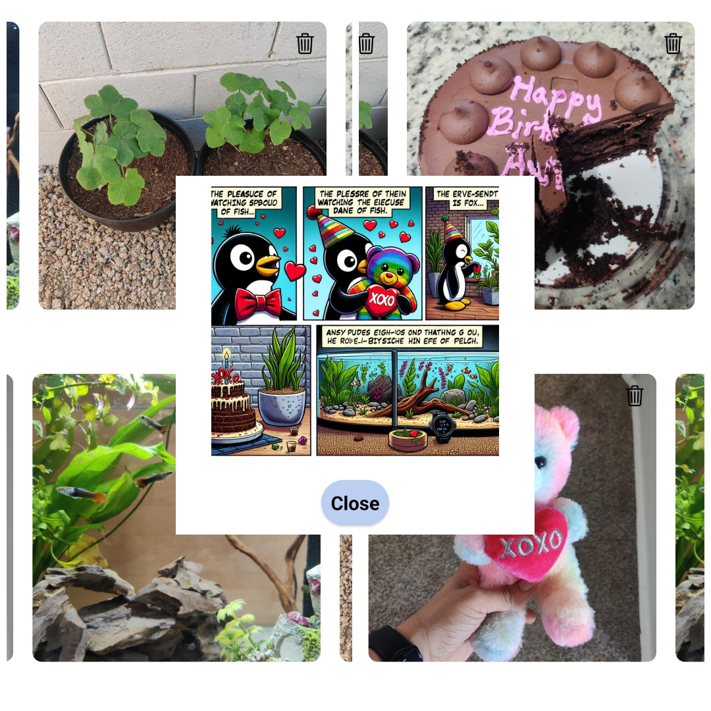

# StoryToons

[Demo](https://youtu.be/cv9Q89-YLYc)

Ever wished you could step into the world of comics like Calvin and Hobbes, Garfield, or your favorite Manga? Imagine being the star of your own comic strip, or even better, crafting your unique stories into engaging comic adventures. Welcome to Meta Tales, where your imagination takes center stage! Dive in and create comic strips that bring your stories to life like never before.

## Inspiration
 
Our journey began with a simple yet powerful theme: 'Inspiring creativity using Generative AI'. During our brainstorming sessions, we fondly remembered a beloved comic book from our childhood called Supandi, which we eagerly awaited every Sunday with the newspaper back home in India. This nostalgic memory sparked an idea in our minds: wouldn't it be amazing if we could transform our vacation memories or everyday moments into personalized comics?
 
## What it does
 
Our application allows users to take their posted stories and effortlessly convert them into vibrant comics. These comics are then showcased on their profile. From the collection of comic pages, users can create their very own comic books, turning their life moments into a visual storytelling experience.

 
## How we built it
 
We developed the mobile app using React Native, integrating OpenAI API keys along with AWS cloud services to handle data storage and processing. Specifically, we utilized DynamoDB for database management, Lambda functions for serverless compute services, and API Gateway for creating and maintaining APIs. This combination ensured our application was scalable, efficient, and responsive.
 
## Challenges we ran into
 
One of our biggest challenges was managing and storing vast amounts of data. We had to determine the necessary data requirements and the most suitable cloud-based services. After thorough research, we decided to use DynamoDB and S3, which provided the scalability and reliability we needed. Additionally, we faced significant hurdles with the OpenAI API. There were instances where the API failed, and the generated images did not meet our expectations. This required extensive prompt engineering to fine-tune the prompts and achieve the desired output quality.
 
## Accomplishments that we're proud of
 
We are immensely proud of completing this project on time with just the two of us on the team. Moreover, we take great pride in the unique and creative idea we brought to life, which combines technology and creativity in an engaging way.
 
## What we learned
 
Throughout this project, we gained valuable insights into mobile app development, various generative AI models, and their functionalities. We also learned the significance of an intuitive and appealing UI in enhancing user experience. Furthermore, we delved deep into cloud services, understanding the nuances of DynamoDB, Lambda functions, and API Gateway, which were crucial for our application’s infrastructure.
 
## What's next for Storytoons
 
Our future plans for Storytoons include upgrading the feature from creating comics from images to generating comics from videos, enabling a richer storytelling experience. Additionally, we aim to handle the creation of comics for stories involving multiple users, allowing collaborative storytelling. We also plan to incorporate world-building elements, enabling users to create detailed and immersive worlds within their comics.
